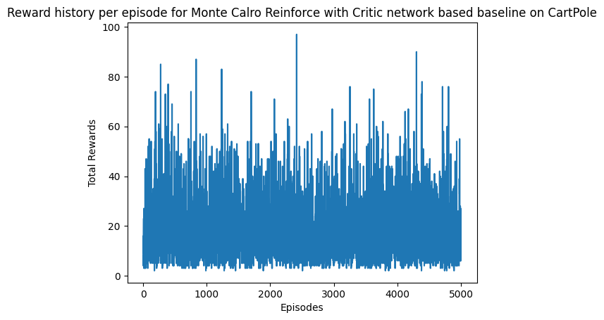

# SUMMARY
This repository is an empirical study of the architectural limits, mathematical paradoxes, and evolutionary lineage of classic Deep Reinforcement Learning algorithms. Rather than simply attempting to "solve" benchmark environments, this project documents where, how, and why specific RL architectures break down when subjected to complex physics and continuous control tasks.

By testing these algorithms across two fundamentally opposed environments—Acrobot (a sparse-penalty, goal-oriented task) and CartPole (a dense-reward, infinite-horizon survival task)—we trace the natural evolution of modern RL, demonstrating how the mathematical failures of one algorithm explicitly dictate the evolution of the next.

## Key Discoveries and Milestones

- **Environment Design Dependence:** The experiments clearly demonstrate that algorithmic failure modes are not environment-agnostic; they are strictly defined by the environment's reward topology and physics. For instance, Acrobot’s sparse, penalty-only structure mathematically inverted pure Policy Gradients into continuous suppression, while CartPole’s dense, positive survival rewards triggered runaway Q-value hallucinations in DQN. Furthermore, CartPole's binary action space forced continuous limit cycles (Bang-Bang control), actively preventing continuous-control networks from ever achieving static convergence.

- **Replay Buffer Dynamics:** Across all Value-based methods, the capacity of the Replay Buffer acts as a hidden double-edged sword. The experiments confirm that depending on the environment, large buffer sizes can lead to brute-force convergence for Value-based methods, or they can lead to historical drag (over-saturating the memory with "perfect" states, leading to overfitting and forgetting critical recovery maneuvers).

- **The Maximization Bias of Deep Q-Network (DQN):** Standard Deep Q-Networks suffer from destructive optimistic feedback. By using the same network to select and evaluate actions, DQN bootstraps its own statistical noise, causing violent target thrashing and shattered weights.

- **Instability of Double DQN:** Upgrading to a Double DQN successfully cures Maximization Bias by decoupling evaluation from selection, but it exposes underlying structural flaws. The model suffers from flat gradients (lazy policy) in uniform reward environments and remains highly vulnerable to $\epsilon$-greedy exploration sabotage.

- **Limitations of Dueling DDQN:** Dueling DDQN is a mathematical step up from DDQN, but introduces its own set of issues by decoupling State Value and Advantage calculations. This decoupling can lead to bifurcated gradient interference during early training, while the mean-normalized advantage calculation is severely afflicted by small action-space sensitivity (where a single sub-optimal action heavily skews the baseline).

- **The Survival Horizon Bottleneck:** The fundamental limitation of the Bellman equation in continuous-control environments is the Survival Horizon Bottleneck. Over hundreds of steps, microscopic statistical noise in the neural network's predictions continuously compounds, eventually causing the gradient to lose its razor-sharp precision and forcing an inevitable policy collapse.

- **The Paradoxes of Monte Carlo REINFORCE:** To escape the bootstrapping trap of the DQN family, the architecture was shifted to pure Policy Gradients utilizing full episodic returns ($G_t$). This analysis documents the three fatal mathematical traps of pure Monte Carlo methods:
  - *The Absolute Scaling Bias:* Pure REINFORCE collapses under "All-Negative" or "All-Positive" environment rewards.
  - *The Relativity Trap:* Attempting to center the gradients using episodic normalization completely destroys the network's ability to compare performance across different runs, mathematically punishing the best actions of highly successful episodes.
  - *The High-Variance Moving Target:* Depending on the environment, quick Critic convergence can lead to gradient starvation for the Actor network, or it can unveil irreconcilable mathematical paradoxes caused by compounded statistical noise over long horizons.


## Conclusion: Practical Showcase of the Bias - Variance Tradeoff

Ultimately, this repository empirically maps the exact boundaries of the classic Bias-Variance tradeoff in Deep Reinforcement Learning. The transition from standard DQN to Dueling DDQN demonstrates the extreme lengths to which Value-based methods can be optimized, but it simultaneously reveals their hard mathematical ceiling: the compounding error of 1-step bootstrapping in continuous survival tasks. Conversely, the exploration of Monte Carlo REINFORCE proves that while full episodic returns successfully eliminate this bootstrapping bias, they introduce catastrophic statistical variance that effectively blinds the network.

The fundamental takeaway of this study is that hyperparameter tuning cannot cure a structural algorithmic misalignment. To achieve true asymptotic stability in complex, continuous-control physics, the architecture must evolve beyond these foundational algorithms. The inevitable mathematical conclusion of these experiments points directly to the necessity of hybrid Actor-Critic architectures—such as Proximal Policy Optimization (PPO) or Soft Actor-Critic (SAC). These modern architectures represent the next evolutionary step, leveraging Temporal Difference (TD) learning to train a stable Critic while utilizing a continuous Policy network to entirely bypass the volatile $\epsilon$-greedy exploration traps of the DQN family.

---

# ANALYSIS

## Part 1: Acrobot


<figure style="text-align: center;">
  
  <figcaption><i><b>Figure 1.0.</b> Acrobot Environment </i></figcaption>
</figure>

The [Acrobot](https://gymnasium.farama.org/environments/classic_control/acrobot/) environment presents a classic sparse-reward reinforcement learning challenge where the agent receives a constant punishment of **-1** for every step the system remains below the target line and a reward of **0** upon achieving the target height. With a  maximum episode length of 500 steps, the minimum  theoretical reward is  -500. To maximize the total reward, the model is forced to discover the optimal sequence of actions to achieve the target as quickly as possible.

---

### 1.1. Deep Q Network
DQN serves as the baseline for these experiments and while capable of learning policies in discrete action spaces, DQN fundamentally suffers from **Maximization Bias** because it uses the max operator to both select and evaluate the target action accruing early positive estimation errors.

$$Q_{target} = R + \gamma \max_{a'} Q(s', a')$$


<figure style="text-align: center;">
  
  <figcaption><i><b>Figure 1.1.1.</b> Total Rewards per Episode </i></figcaption>
</figure>

**Baseline Observations:**
The above chart demonstrates that the DQN can converge to a stable policy, however, it does suffer from two issues:

- *Exploration Penalty:* The  $\epsilon$-greedy action selection policy forces a random action exploration at least 1% of the time during later episodes and even a single sub-optimal random action can entirely destabilize the pendulum's momentum, requiring significant step counts to recover.

- *Target Thrashing:* The target network was configured to update every 10 episodes. During early training, episodes frequently reach the 500-step limit, resulting in a target update every 5000 steps. However, as the policy improves and episodes end in under 100 steps, the target network updates every 1000 steps. This accelerated update frequency during later stages destabilizes the evaluation baseline, causing the visible variance dips near the end of the training run.

<figure style="text-align: center;">
  
  <figcaption><i><b>Figure 1.1.2.</b> Target Network updates on number of steps rather than episodes </i></figcaption>
</figure>

**Iteration 1: Step Based Target updates**
The target network synchronization was strictly locked to a step count rather than an episode count to address the variable update frequency, significantly cleaning the behavior of the DQN by preventing high-frequency target drift.

<figure style="text-align: center;">
  
  <figcaption><i><b>Figure 1.1.3.</b> Target network update using Polyak Averaging </i></figcaption>
</figure>

**Iteration 2: Polyak Averaging**
To further stabilize the learning gradient, standard hard target updates were replaced with Polyak Averaging:

$$\theta_{target} = \tau . \theta_{target} + (1 - \tau) . \theta_{policy}$$

By continuously blending a fractional percentage of the policy weights into the target network, the variance in the reward curve is visibly reduced. Despite this mathematical stabilization, the persistent, sparse dips highlight the fundamental limitation of $\epsilon$-greedy exploration in momentum-critical environments.

---

### 1.2. Double Deep Q Network
The Double DQN addresses the **Maximization Bias** inherent in standard DQN which mitigates this bias by decoupling action selection from action evaluation- the online policy network selects the best action, but the frozen target network evaluates the true $Q$-value of that specific action.

$$Q_{target} = R + \gamma . Q_{target}(s', \underset{a'}{\operatorname{argmax}}Q_{policy}(s', a'))$$

<figure style="text-align: center;">
  
  <figcaption><i><b>Figure 1.2.1.</b> Total Rewards per Episode </i></figcaption>
</figure>

**Baseline Observations:** Counterintuitively, Figure 1.2.1 demonstrates that the baseline DDQN appears to perform worse than the standard DQN, exhibiting deeper crashes and longer stabilization times. This occurs because the standard DQN's inherent optimism artificially inflates state values, temporarily masking the instability of the learning process. DDQN provides a much stricter, honest evaluation of the states, which fully exposes the severe Target Thrashing caused by the variable episode-based update frequency.

<figure style="text-align: center;">
  
  <figcaption><i><b>Figure 1.2.2.</b> Target network update fixed on number of steps </i></figcaption>
</figure>

**Iteration 1: Step Based Target Updates** Locking the target network synchronization to a strict step count rather than an episode count, the evaluation baseline is stabilized because DDQN relies on conservative value estimations, isolating the network from high-frequency target drift yields a visible improvement and the reward curve stabilizes significantly faster than the baseline, reducing the frequency of catastrophic drops.

<figure style="text-align: center;">
  
  <figcaption><i><b>Figure 1.2.3.</b> Target network update using Polyak averaging </i></figcaption>
</figure>

**Iteration 2:** The Polyak Averaging mathematically smooths the evaluation baseline, resulting in the lowest variance among the DDQN iterations. As observed previously, the remaining high-frequency dips represent the rigid lower bound of the $\epsilon$-greedy exploration strategy, which inevitably forces sub-optimal actions in a highly sensitive physics environment.

---

### 1.3. Dueling DDQN

While DDQN solved the evaluation bias, it still calculated the $Q$-value as a single monolithic estimation. In environments like Acrobot, certain states are fundamentally disadvantageous regardless of the action taken (e.g., hanging completely still with zero momentum) and to optimize learning in these states, the network was upgraded to a Dueling architecture, which bifurcates the final hidden layers into two independent streams:

- *State-Value Stream $V(s)$:* Estimates the inherent value of merely being in a given state.

- *Advantage Stream $A(s, a)$:* Estimates the relative utility of taking a specific action compared to the average action in that state.

To resolve the Identifiability Problem—where the network could infinitely shift constants between $V(s)$ and $A(s,a)$ without altering the final $Q$-value—the Advantage stream must be mathematically aggregated. Two distinct normalization strategies were benchmarked.

#### **1.3.1. Dueling DDQN with Mean Normalized Advantage**

Mean normalization forces the average advantage of all possible actions to be zero. This approach increases the stability of the optimization process because the advantages only need to track the relative differences between actions.

$$Q(s, a) = V(s) + \left( A(s, a) - \frac{1}{|\mathcal{A}|} \sum_{a'} A(s, a') \right)$$


<figure style="text-align: center;">
  
  <figcaption><i><b>Figure 1.3.1.1.</b> Baseline run with mean normalized Dueling DDQN </i></figcaption>
</figure>

**Baseline Observations:** While subject to the same Target Thrashing as earlier models, the Dueling architecture is structurally more sensitive to this instability during early training due to two unique conditions:

- *Bifurcated Gradient Interference:* The network must simultaneously estimate two interdependent values ($V$ and $A$). When the target baseline thrashes, these two streams can temporarily interfere with one another, leading to high variance in early reward convergence.

- *Small Action-Space Sensitivity:* Acrobot features a highly constrained discrete action space consisting of only 3 actions. By subtracting the mean in such a sparse matrix, the mathematical update is highly sensitive to outliers; a single severely sub-optimal action heavily skews the mean, constantly shifting the absolute scale of the $Q$-values during the $\epsilon$-greedy exploration phase.


<figure style="text-align: center;">
  
  <figcaption><i><b>Figure 1.3.1.2.</b> Target update based on number of steps </i></figcaption>
</figure>


**Iteration 1: Step Based Target Update** By locking the target network to a stationary step count, the network is forced to train against its own skewed, early-exploration Advantage estimates for thousands of steps before correction. However, as the Replay Buffer reaches a critical mass of high-quality transitions, the sheer volume of optimal data overwhelms the mathematical noise of the Mean Normalization. The network effectively brute-forces the alignment of the Value and Advantage streams, resulting in the sudden, extremely dense plateau observed in the latter half of training.

<figure style="text-align: center;">
  
  <figcaption><i><b>Figure 1.3.1.3.</b> Target update based on Polyak Averaging </i></figcaption>
</figure>

**Iteration 2: Polyak Averaging** Implementing continuous, fractional target updates prevents the network from training against stationary, skewed mathematics for prolonged periods. Aside from a brief initialization lag where the slow target network temporarily misaligns with the bifurcated policy streams, this continuous smoothing drastically reduces variance and generates the most stable reward curve.

#### **1.3.2. Dueling DDQN with Max Normalized Advantage**

Max normalization anchors the advantage of the absolute best action to exactly zero. Consequently, all sub-optimal actions yield a negative advantage. Mathematically, this forces the state-value $V(s)$ to perfectly equal the true $Q$-value of the optimal action ($V(s) = \underset{a} \max Q(s, a)$).

$$Q(s, a) = V(s) + \left( A(s, a) - \max_{a'} A(s, a') \right)$$


<figure style="text-align: center;">
  
  <figcaption><i><b>Figure 1.3.2.1.</b> Baseline Dueling DDQN Max Normalized </i></figcaption>
</figure>

**Baseline Observations:** Grounding the optimal action's advantage at zero and forcing all others to be strictly negative, the Value stream rapidly converges to the true $Q$-value of the best action. This keeps the bifurcated streams highly synchronized. However, the model remains susceptible to the standard high-frequency target thrashing and the $\epsilon$-greedy exploration penalty.

<figure style="text-align: center;">
  
  <figcaption><i><b>Figure 1.3.2.2.</b> Target update based on number of steps </i></figcaption>
</figure>


**Iteration 1: Step Based Target Update** Locking the target network update to a strict 5000-step interval successfully rescues the standard DQN and DDQN, but introduces a new vulnerability for the Dueling architecture. The policy network begins to overfit to the rigidly frozen target network and when the target network finally updates, the policy experiences a violent "target shock" as the mathematical ground suddenly shifts beneath the Value and Advantage streams especially marked by the collapse in stable policy in later episodes.

<figure style="text-align: center;">
  
  <figcaption><i><b>Figure 1.3.2.3.</b> Target update based on Polyak Averaging </i></figcaption>
</figure>


**Iteration 2: Polyak Averaging** The synergy between Max Normalization and Polyak Averaging produces the most mathematically stable and performant architecture in the Acrobot environment. Because $V(s)$ is strictly anchored to the best known action rather than a blended average of all actions, the Value stream and the Advantage stream do not experience gradient interference and even while the Polyak target network is lagging behind, the optimal baseline remains rigid.

---

### 1.4. Monte Carlo REINFORCE

To contrast the off-policy Value-Based methods (DQN family), a pure on-policy Monte Carlo REINFORCE model was implemented. Unlike DQN, which bootstraps state values step-by-step, REINFORCE relies on the full episodic return ($G_t$) to directly update the policy distribution. In the sparse, penalty-only environment of Acrobot, this architectural difference exposes several fundamental vulnerabilities of Policy Gradients. Three versions of this model were implemented.

#### **1.4.1. Monte Carlo REINFORCE with No Baseline**

The baseline REINFORCE algorithm updates the policy by scaling the gradient of the log-probability of an action by its total chronological return.

$$\nabla J(\theta) \propto \sum_{t} G_t \nabla_{\theta} \ln \pi_{\theta}(a_t|s_t)$$

<figure style="text-align: center;">
  
  <figcaption><i><b>Figure 1.4.1.1.</b> Total Rewards per episode </i></figcaption>
</figure>

**Baseline Observations:** The raw REINFORCE agent completely fails to converge, exhibiting massive variance and gradient thrashing owing to a specific design flaw:

- *All Negative rewards:* Because Acrobot's rewards are strictly negative, $G_t$ is always negative. Consequently, every gradient update is mathematically interpreted as a punishment. The network indiscriminately suppresses its own actions without a concept of relative success, resulting in chaotic, unguided exploration.


<figure style="text-align: center;">
  
  <figcaption><i><b>Figure 1.4.1.2.</b> Lowered Learning Rate </i></figcaption>
</figure>

**Iteration 1: Lower Learning Rate** Dropping the learning rate to $3 \times 10^{-4}$ seems to temporarily stabilize the model reducing the scale of the punishment, thereby lessening the destructiveness of the gradient update

Since the policy isn't instantly shattered by a single negative return, the agent can linger in a "good" region of the weight space for a few consecutive episodes which allows it to continuously sample winning actions, resulting in visible clusters of success rather than isolated spikes.

However, because the return is fundamentally negative, the network is still mathematically walking backward. It takes longer to destroy the good policy, but the continuous negative updates eventually erode the weights, and the agent inevitably collapses back to the baseline floor.


#### **1.4.2. Monte Carlo REINFORCE with Episodic Mean/Std Normalization**

To center the gradient and provide a mathematical "Zero," the returns were normalized using the mean and standard deviation of the individual episode ($A_t = \frac{G_t - \mu}{\sigma}$).

<figure style="text-align: center;">
  
  <figcaption><i><b>Figure 1.4.2.1.</b> Total Rewards per episode </i></figcaption>
</figure>

**Baseline Observations:** Counterintuitively, applying a standard statistical normalization baseline caused the network to completely paralyze, as demonstrated clearly by the immediate flatline in Figure 1.4.2.1.

- *The "Running Out the Clock" Illusion:* Normalizing returns within a single timeout episode mathematically inverts the learning signal. Because accumulated penalties strictly increase over time, late-stage failure states (e.g., step 499) are mathematically "greater" than the episode's mean. The network is tricked into rewarding the random actions taken right before the timeout limit, actively suppressing early-stage actions and collapsing the policy into deterministic failure.

<figure style="text-align: center;">
  
  <figcaption><i><b>Figure 1.4.2.2.</b> Lowered learning rate </i></figcaption>
</figure>


**Iteration 1: Lower Learning Rate** Similar to the no Baseline version, a lowered learning rate reduces the scale of penalty and preserved the network's initial entropy for a longer time and allowed the agent an extended "grace period" of random exploration where it occasionally stumbled upon the target line. However, because the fundamental mathematical flaw of the episodic baseline remained active, the lower learning rate merely delayed the inevitable and once the network fully absorbed the inverted gradient signal, the model permanently collapsed.


#### **1.4.3. Monte Carlo REINFORCE with Critic network Baseline**

To bypass episodic normalization flaws, a separate regression neural network (the Critic) was introduced to predict state-specific values $V(s)$, defining the Advantage as $A_t = G_t - V(s)$.

<figure style="text-align: center;">
  
  <figcaption><i><b>Figure 1.4.3.1.</b> Total Rewards per episode </i></figcaption>
</figure>

**Baseline Observations:** The Actor-Critic architecture resulted in an immediate and permanent flatline at the maximum penalty threshold, driven by two interacting failure modes:

- *Premature Critic Convergence:* In a complex environment, a randomly initialized policy will consistently hit the maximum penalty limit. The Critic network quickly recognizes this pattern and perfectly learns to predict the -500 failure state $(V(s) \approx G_t)$.

- *Gradient Starvation:* Because the Critic perfectly predicts the failure, the Advantage evaluates to exactly zero ($A_t = 0$) and this zero-signal starves the Actor of any gradient update. Without the forced exploration mechanism of a Value-based agent (like $\epsilon$-greedy), the Actor's probability distribution permanently freezes, trapping the architecture in a self-fulfilling loop of failure.

<figure style="text-align: center;">
  
  <figcaption><i><b>Figure 1.4.3.2.</b> Lowered Learning Rate </i></figcaption>
</figure>


**Iteration 1: Two-Speed Learning** To artificially break the convergence loop, a Two-Timescale update rule was implemented where the Critic's learning rate was drastically reduced to $10^{-6}$ while the Actor remained at $3 \times 10^{-4}$. This causes the Critic to constantly lag behind the Actor's actual performance which creates a continuous, non-zero Advantage signal that keeps the Actor's weights fluid, resulting in a dense cluster of successful runs. However, this only delays Gradient Starvation; once the slow Critic eventually memorizes the optimal policy, the gradients vanish, and the model collapses.

---

## Part 2: CartPole

 <figure style="text-align: center;">
  
  <figcaption><i><b>Figure 2.0.</b> CartPole Environment </i></figcaption>
</figure>


The [CartPole](https://gymnasium.farama.org/environments/classic_control/cart_pole/) environment is a dense, survival-based task. It yields a continuous reward of +1 for every time step the termination condition is not met (i.e., the pole doesn't fall and the cart doesn't leave the bounds). The environment automatically truncates at a maximum step length of 500. To maximize the total reward, the model is forced to keep the system balanced for as long as possible.

---

>  ***Notes:***  
>- We start these experiments using the hyper parameter values set for Acrobot and use the better performing models as baseline for the CartPole environment.
>- The CartPole environment features a strictly binary action space: apply a fixed force left, or apply a fixed force right. Because there is no "Do Nothing" (No-op) action, the agent can never achieve true static equilibrium. Instead, it must learn Bang-Bang Control (a limit cycle)—rapidly oscillating the pole back and forth across the center line to maintain dynamic balance..       


---

### 2.1. Deep Q Network

<figure style="text-align: center;">
  
  <figcaption><i><b>Figure 2.1.1.</b> Total Rewards per episode </i></figcaption>
</figure>

**Baseline Observations:** The fundamental mathematical flaw of a standard Deep Q-Network is **Maximization Bias**. When placed in a survival environment that generates continuous positive rewards, this bias exposes a new set of architectural failures:

- *Destructive Optimistic Feedback (Q-Value Inflation):* Because standard DQN evaluates actions using a strict max operator, it is inherently optimistic. Across a 500-step survival horizon, the network continuously bootstraps minor statistical noise, eventually hallucinating absurd Q-values. This acts as a runaway positive feedback loop, flattening the gradients and causing the neural network weights to abruptly shatter.

- *Replay Buffer Over-saturation:* During a successful episode, the model pumps the Replay Buffer with thousands of transitions where the pole is nearly perfectly balanced. This causes the critical "recovery" transitions (where the pole was leaning dangerously) to get diluted or entirely pushed out of memory. The agent essentially overfits to a state of perfection and completely forgets how to recover from a tilt.


<figure>
  <table>
    <tr>
      <td align="center">
        (a)<br>
        
      </td>
      <td align="center">
        (b)<br>
        
      </td>
    </tr>
    <tr>
      <td align="center">
        (c)<br>
        
      </td>
      <td align="center">
        (d)<br>
        
      </td>
    </tr>
  </table>
  <figcaption align="center">
    <i><b>Figure 2.1.2.</b> Comparing effect of Buffer size on Algorithm Stability where figure (a) has a Buffer Size of 5,000, (b) has a buffer size of 10,000, (c) has a buffer size of 100,000  and (d) has a buffer size of 500,000</i>
  </figcaption>
</figure>

**The Data Pipeline Autopsy:** Testing various Replay Buffer capacities reveals that a size of 100,000 (*Fig. 2.1.1. - c*) provides the optimal mathematical balance. It holds enough diverse data to prevent amnesia, while allowing the terrible, chaotic transitions from the earliest episodes to naturally age out of the system.

Ultimately, there is no way to hyperparameter-tune a way out of a biased equation. Learning rates, batch sizes, and optimal buffer capacities only dictate how fast or how smoothly the math executes. If the Bellman equation itself is hallucinating due to Maximization Bias, tuning simply optimizes the failure


---

### 2.2. Double Deep Q Network

<figure style="text-align: center;">
  
  <figcaption><i><b>Figure 2.2.1.</b> Total Rewards per episode </i></figcaption>
</figure>

**Baseline Observations:** By evaluating actions using a separate target network, DDQN successfully neutralizes the Maximization Bias that plagued the standard DQN. Consequently, the network stops hallucinating inflated Q-values, which counters the destructive optimistic feedback. This mathematical correction allows for visibly faster recovery times and denser clusters of maximum reward successes. However, neutralizing this bias completely exposes the remaining structural vulnerabilities inherent to Value-based, discrete-action algorithms in continuous physics environments.


<figure>
  <table>
    <tr>
      <td align="center">
        (a)<br>
        
      </td>
      <td align="center">
        (b)<br>
        
      </td>
    </tr>
    <tr>
      <td align="center">
        (c)<br>
        
      </td>
      <td align="center">
        (d)<br>
        
      </td>
    </tr>
  </table>
  <figcaption align="center">
    <i><b>Figure 2.2.2.</b> Comparing effect of Buffer size on Algorithm Stability where figure (a) has a Buffer Size of 5,000, (b) has a buffer size of 10,000, (c) has a buffer size of 100,000  and (d) has a buffer size of 500,000</i>
  </figcaption>
</figure>

Consistent with the standard DQN experiments, a Replay Buffer capacity of 100,000 (*Fig. 2.2.2. - c*) remains the mathematical sweet spot, effectively balancing recent successes with critical recovery states. Yet, despite fixing the Q-value inflation and optimizing the data pipeline, the DDQN policy still experiences violent episode-to-episode whiplash as a consequence of two unaddressed architectural bottlenecks:


 - *The $\epsilon$-Greedy Sabotage:* DDQN relies on an $\epsilon$-greedy exploration strategy. Even when $\epsilon$ decays to a minimum value (e.g., $0.01$), the agent is mathematically forced to make a completely random, irrational choice $1\%$ of the time. In a continuous physics limit cycle where momentum compounds non-linearly, jerking the controls in the wrong direction even once can instantly push the pole past the threshold of recovery, shattering an otherwise perfect episode.

 - *The Lazy Policy (Flat Gradients):* In environments where the reward is uniform ($+1$ for every step of survival, regardless of stability), the network cannot distinguish between an exceptionally well-centered configuration and a dangerously wobbling configuration that merely happens to survive the current frame. The value stream flattens, meaning the network operates with dangerously narrow mathematical margins between optimal and fatal decisions.

Hyperparameter tuning (such as altering learning rates or batch sizes) cannot cure these structural misalignments. Tuning merely dictates the timeline of the inevitable crashes.

---

### 2.3. Dueling DDQN

There are two implementations of Dueling DDQN:

#### **2.3.1. Dueling DDQN with Mean Normalized Advantage**

<figure style="text-align: center;">
  
  <figcaption><i><b>Figure 2.3.1.1.</b> Total Rewards per episode </i></figcaption>
</figure>

**Baseline Observations:** Similar to the DDQN upgrade, the Dueling architecture makes the network's predictions mathematically precise, but it still learns from the exact same diluted Replay Buffer. Because the Dueling network is so efficient at learning the State Value $V(s)$, it realizes that the "perfectly balanced center" state is highly valuable, rushes to that state, and instantly floods its memory with hundreds of thousands of identical transitions. When the $\epsilon$-greedy dice roll finally forces an exploratory mistake, the model finds zero examples of how to recover from a tilted pole in its buffer, and the entire network crashes.


<figure>
  <table>
    <tr>
      <td align="center">
        (a)<br>
        
      </td>
      <td align="center">
        (b)<br>
        
      </td>
    </tr>
    <tr>
      <td align="center">
        (c)<br>
        
      </td>
      <td align="center">
        (d)<br>
        
      </td>
    </tr>
  </table>
  <figcaption align="center">
    <i><b>Figure 2.3.1.2.</b> Comparing effect of Buffer size on Algorithm Stability where figure (a) has a Buffer Size of 5,000, (b) has a buffer size of 10,000, (c) has a buffer size of 100,000  and (d) has a buffer size of 500,000</i>
  </figcaption>
</figure>

Once again, a Replay Buffer capacity of 100K (Fig. 2.3.1.2. - C) performs best, avoiding the worst extremes of Amnesia and Historical Drag. Theoretically, Dueling DDQN is supposed to stabilize the policy by learning the inherent "safety" of the state $V(s)$ independent of the actions.

However, CartPole features a binary action space, which completely breaks the mean normalization math. By forcing the mean advantage of two actions to zero, the "good" action is mathematically tethered to the "bad" action. The $V(s)$ stream becomes polluted; it stops learning the true "safety" of the balanced pole and simply becomes a dumping ground for the mathematical noise caused by calculating the binary mean.


<figure style="text-align: center;">
  
  <figcaption><i><b>Figure 2.3.1.3.</b> Hyperparameter tuning test on Dueling DDQN </i></figcaption>
</figure>

As demonstrated in Figure 2.3.1.3, attempting to brute-force stability via hyperparameter tuning—such as drastically lowering the learning rate or completely disabling exploration ($\epsilon = 0.0$)—only creates a brittle policy that inevitably collapses. Hyperparameter tuning cannot save this architecture because the scalars are not the root cause of the instability. The instability stems from an irreconcilable conflict between a discrete value-based architecture utilizing mean normalization and the physics of an infinite-horizon limit cycle.

#### **2.3.2. Dueling DDQN with Max Normalized Advantage**

<figure style="text-align: center;">
  
  <figcaption><i><b>Figure 2.3.2.1.</b> Total Rewards per episode </i></figcaption>
</figure>

**Baseline Observations:** By anchoring the optimal action's advantage to exactly zero, Max Normalization successfully prevents the "Binary Action Trap" seen in the Mean implementation. The Value stream ($V(s)$) is finally allowed to accurately evaluate the inherent safety of the environment without being mathematically polluted by the worst-case alternative action. However, while this mathematical correction stabilizes the gradient's baseline, it provides no immunity against the structural flaws of the replay pipeline or the environment's underlying physics.

<figure>
  <table>
    <tr>
      <td align="center">
        (a)<br>
        
      </td>
      <td align="center">
        (b)<br>
        
      </td>
    </tr>
    <tr>
      <td align="center">
        (c)<br>
        
      </td>
      <td align="center">
        (d)<br>
        
      </td>
    </tr>
  </table>
  <figcaption align="center">
    <i><b>Figure 2.3.2.2.</b> Comparing effect of Buffer size on Algorithm Stability where figure (a) has a Buffer Size of 5,000, (b) has a buffer size of 10,000, (c) has a buffer size of 100,000  and (d) has a buffer size of 500,000</i>
  </figcaption>
</figure>

Consistent with all previous architectures, a Replay Buffer capacity of 100,000 (Fig. 2.3.2.2. - c) achieves the highest stability. Yet, even with optimized memory and unpolluted advantage calculations, the agent continues to exhibit chaotic variance. Because the binary action space lacks a "Do Nothing" option, the agent can never achieve true static equilibrium. It is forced to continuously inject kinetic energy into the system, oscillating the pole back and forth in a high-frequency Limit Cycle. This perpetually jittering physical state creates a moving target for the neural network, preventing the weights from ever fully settling.

<figure style="text-align: center;">
  
  <figcaption><i><b>Figure 2.3.2.3.</b> Hyperparameter Tuned Dueling DDQN with Max Normalized Advantage </i></figcaption>
</figure>

As shown in Figure 2.3.2.3, hyperparameter tuning ultimately fails to eliminate this variance because the root cause is a fundamental limitation of the Bellman equation in continuous-control environments: the Survival Horizon Bottleneck.While Max Normalization stops the network from artificially inflating Q-values based on alternative bad actions, the model is still fundamentally a bootstrapping algorithm ($Y = R + \gamma \max Q$). In an environment where the agent survives for 500 steps, the network passes its own estimations backward 500 times in a row without hitting a physical terminal state (a "reality check") to ground the math. Over hundreds of steps, microscopic statistical noise in the neural network's predictions continuously compounds, eventually causing the gradient to lose its razor-sharp precision and forcing an inevitable policy collapse.

---

### 2.4. Monte Carlo REINFORCE

Having established the limitations of Value-based methods in CartPole, the architecture was shifted to Policy Gradients. Unlike DQN, which bootstraps value estimates, pure Monte Carlo REINFORCE updates the network using the true, full episodic return ($G_t$). This eliminates Maximization Bias, but exposes the architecture to massive statistical variance.

#### **2.4.1. Monte Carlo REINFORCE with no Baseline**

<figure style="text-align: center;">
  
  <figcaption><i><b>Figure 2.4.1.</b> Total Rewards per Episode </i></figcaption>
</figure>

**Baseline Observations:** In stark contrast to the Acrobot environment where this model suffered from an all-negative reward bias, in CartPole, the model suffers from an *all-positive reward bias*. Without a mathematical "zero" to act as a relative center, the network cannot distinguish between optimal and fatal decisions. It indiscriminately pushes all probabilities up until the weights saturate, destroying the policy's entropy and causing a deterministic collapse into a single action.

There is no way to tune the model without fundamentally altering the reward structure to fix the math; the algorithm inherently lacks the ability to understand absolute value without a dynamic baseline.

#### **2.4.2. Monte Carlo REINFORCE with Episodic Mean/Std Normalization**

<figure style="text-align: center;">
  
  <figcaption><i><b>Figure 2.4.2.</b> Total Rewards per Episode </i></figcaption>
</figure>

**Baseline Observations:** With intra-episode normalization, the model continuously thrashes, occasionally spiking but ultimately failing to learn a stable policy. 

By normalizing the returns using the mean ($\mu$) and standard deviation ($\sigma$) of a single episode, the Advantage ($A_t = \frac{G_t - \mu}{\sigma}$) of the early steps is forced to be strongly positive, and the late steps strongly negative. While this intuitively sounds correct since it punishes the actions right before the pole dropped, the fatal mathematical flaw is that it completely destroys the relative comparison *between* different episodes.

By normalizing within the episode, the neural network becomes completely blind to absolute performance. It mathematically punishes the late-stage actions of its best runs, and rewards the early-stage actions of its worst runs. The resulting gradient is pure static noise that causes the model to thrash around, unable to figure out which actions actually lead to long-term survival.

#### **2.4.3. Monte Carlo REINFORCE with Critic Network Baseline**

<figure style="text-align: center;">
  
  <figcaption><i><b>Figure 2.4.3.</b> Total Rewards per Episode </i></figcaption>
</figure>

**Baseline Observations:** This model suffers from the same thrashing due to the high-variance moving target, leaving the Critic in a state of confusion that never resolves.

In a highly sensitive, non-linear environment like CartPole, the final return is incredibly noisy. The Critic looks at the exact same physical state and is given entirely different target values based on how the episode plays out (whether the pole tilted and the model couldn't recover, or whether it executed a flawless save). Because pure Monte Carlo waits until the very end of the episode to calculate the return, $G_t$ contains the compounded variance of every single random event, momentum shift, and exploration action that happened over the subsequent steps.

The Critic is trying to hit a target that is wildly teleporting back and forth. Because the target is pure statistical noise, the Critic's predictions ($V(s)$) never convergeand they just become noise as well. Once the Critic's predictions become inaccurate noise, the Advantage calculation collapses. The Actor network uses a meaningless Advantage to update its policy probabilities, resulting in the violent, static thrashing seen in the chart.


> The reason these specific Monte Carlo implementations cannot be fixed is because their failures are not caused by bugs or poorly tuned hyperparameters, but by irreconcilable mathematical paradoxes inherent to the algorithms themselves when applied to continuous survival environments.

---

# Architectural Highlights

This repository is engineered to transcend standard procedural scripts, utilizing an object-oriented, highly modular architecture designed for rapid experimentation, hyperparameter sweeping, and reproducible research.

* **Core AI Framework:** Built natively in **PyTorch**, utilizing custom neural network modules (`networks.py`) to explicitly define and bifurcate State-Value, Advantage, Actor, and Critic streams.
* **Simulation Environment:** Powered by the **Farama Foundation's Gymnasium** API, utilizing rigorous seed control to ensure deterministic baseline comparisons across highly stochastic physics environments (CartPole-v1, Acrobot-v1).
* **Modular Agent Design:** The optimization math (`agents.py`) is strictly decoupled from the neural network architectures and the training loops (`trainer.py`). This allows for seamless hot-swapping of algorithms (e.g., swapping a standard DQN target update for a Polyak Averaged Dueling update) without rewriting the core data pipeline.
* **Optimized Data Pipelines:** Features a custom, tensor-optimized `ReplayBuffer` (`utils.py`) designed for high-throughput batch sampling. 
* **State-Safe Experimentation Engine:** Hyperparameters are strictly managed via Python `dataclasses` (`config.py`). Experimentation is handled using state-safe memory forks (via `dataclasses.replace`), completely eliminating variable bleed-over during sequential hyperparameter sweeps.
* **Visualizations:** The custom `RLPlotter` class wraps `Matplotlib` to automate the generation of research-grade visualizations. It dynamically handles intra-episode variance rendering (mean ± standard deviation), multi-algorithm comparisons using static color-maps, and automatic hyperparameter text-box injections.

---
# Quick Start

All experiments, hyperparameter configurations, training loops, and chart generations are orchestrated centrally through the main Jupyter Notebook.

**1. Clone the repository**
```bash
git clone [https://github.com/YourUsername/YourRepositoryName.git](https://github.com/YourUsername/YourRepositoryName.git)
cd YourRepositoryName
```

**2. Create a Virtual Environment**
```bash
python -m venv venv
source venv/bin/activate  # On Windows use: venv\Scripts\activate
```

**3. Install Dependencies**
```bash
pip install -r requirements.txt
```

**4. Launch the Notebook**
```bash
jupyter notebook Notebooks/Analysis.ipynb
```
---

# Repository Structure


```text
├── models/                     # Saved model weights and training checkpoints
├── Notebooks/                  # Interactive environment for running experiments
│   └── Analysis.ipynb          # Main execution notebook containing all training runs and chart generation
├── resources/                  # Visual assets, environment GIFs, and saved performance plots
│   ├── acrobot.gif
│   ├── cart_pole.gif
│   ├── DDQN/                   # Plots for Double DQN experiments
│   ├── DQN/                    # Plots for standard DQN experiments
│   ├── Dueling/                # Plots for Dueling architectures
│   │   ├── Max/                # (Max Normalized Advantage)
│   │   └── Mean/               # (Mean Normalized Advantage)
│   └── MonteCarlo/             # Plots for Policy Gradient architectures
│       ├── Critic/             # (Actor-Critic Baseline)
│       ├── Mean/               # (Episodic Mean/Std Baseline)
│       └── NoBaseline/         # (Pure REINFORCE)
├── agents.py                   # RL agent classes managing action selection and optimization steps
├── config.py                   # Hyperparameter dataclasses for modular experiment configurations
├── networks.py                 # PyTorch neural network architectures (Q-Networks, Actors, Critics)
├── README.md                   # Comprehensive empirical analysis and project summary
├── trainer.py                  # Standardized training loops and environment interaction logic
└── utils.py                    # Core utilities including the ReplayBuffer and custom RLPlotter
```

---

# References

This project was developed based on the seminal papers that established the Deep Reinforcement Learning paradigm:

- General RL Foundations and REINFORCE: [*Reinforcement Learning: An Introduction (Sutton & Barto, 2018)*](https://web.stanford.edu/class/psych209/Readings/SuttonBartoIPRLBook2ndEd.pdf)

- DQN: [*Playing Atari with Deep Reinforcement Learning (Mnih et al., 2013)*](https://doi.org/10.48550/arXiv.1312.5602)

- DDQN: [*Deep Reinforcement Learning with Double Q-learning (van Hasselt et al., 2015)*](https://doi.org/10.48550/arXiv.1509.06461)

- Dueling DDQN: [*Dueling Network Architectures for Deep Reinforcement Learning (Wang et al., 2015)*](https://doi.org/10.48550/arXiv.1511.06581)